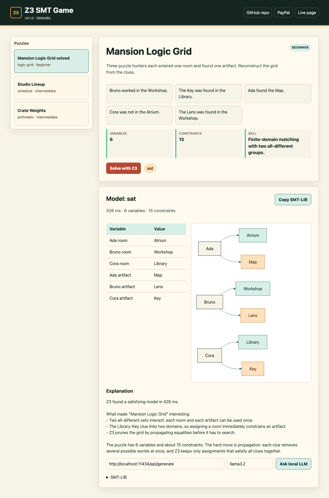
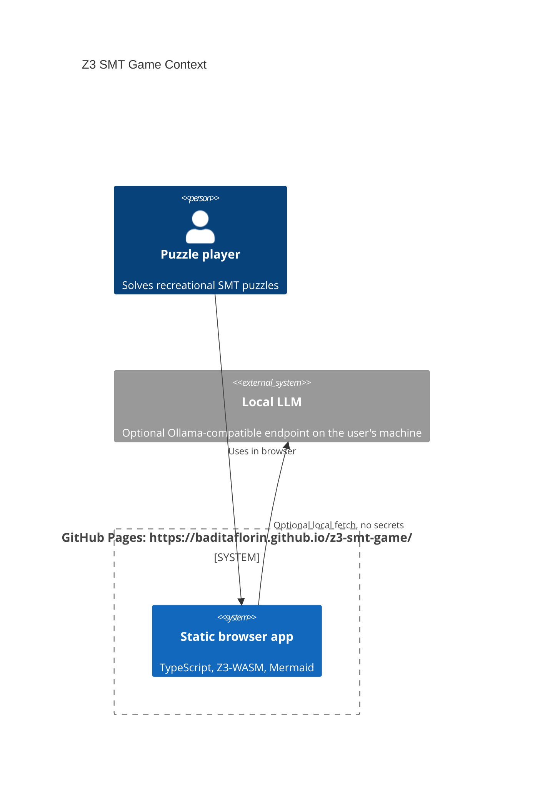

# Z3 SMT Game

Live site: https://baditaflorin.github.io/z3-smt-game/

Repository: https://github.com/baditaflorin/z3-smt-game

PayPal: https://www.paypal.com/paypalme/florinbadita

A browser puzzle lab where Z3-WASM solves logic games and a local LLM explains the constraints.



## Quickstart

```bash
npm install
make install-hooks
make dev
```

Production preview:

```bash
make build
make pages-preview
```

## What It Does

Z3 SMT Game is a static GitHub Pages app for recreational constraint solving. It ships three v1 puzzle types: a logic grid, a talk schedule, and an arithmetic crate puzzle. Z3 runs as WebAssembly in the browser, Mermaid renders solution diagrams, and the explainer can call a user-controlled local Ollama-style endpoint such as `http://localhost:11434/api/generate`.

The app shows the live version and commit in the top bar, plus direct links to:

- https://github.com/baditaflorin/z3-smt-game
- https://www.paypal.com/paypalme/florinbadita

## Architecture



More detail: docs/architecture.md

ADRs: docs/adr/

Deploy guide: docs/deploy.md

Privacy: docs/privacy.md

## Commands

```bash
make help
make lint
make test
make build
make smoke
```

## Deployment

Deployment mode is Mode A: Pure GitHub Pages. The `main` branch publishes `/docs` directly at:

https://baditaflorin.github.io/z3-smt-game/

There is no backend, Docker image, database, hosted LLM, or GitHub Actions workflow in v1.
