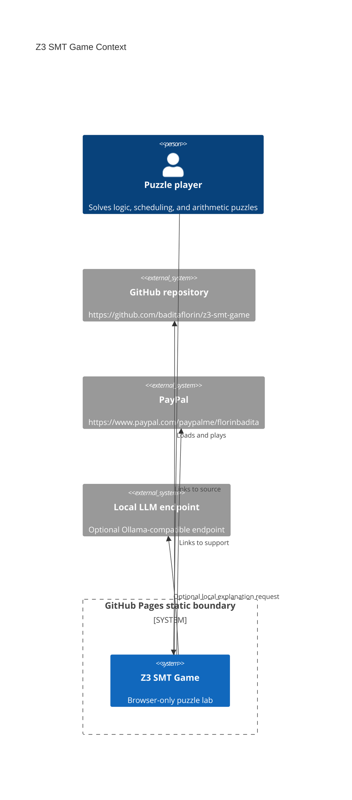
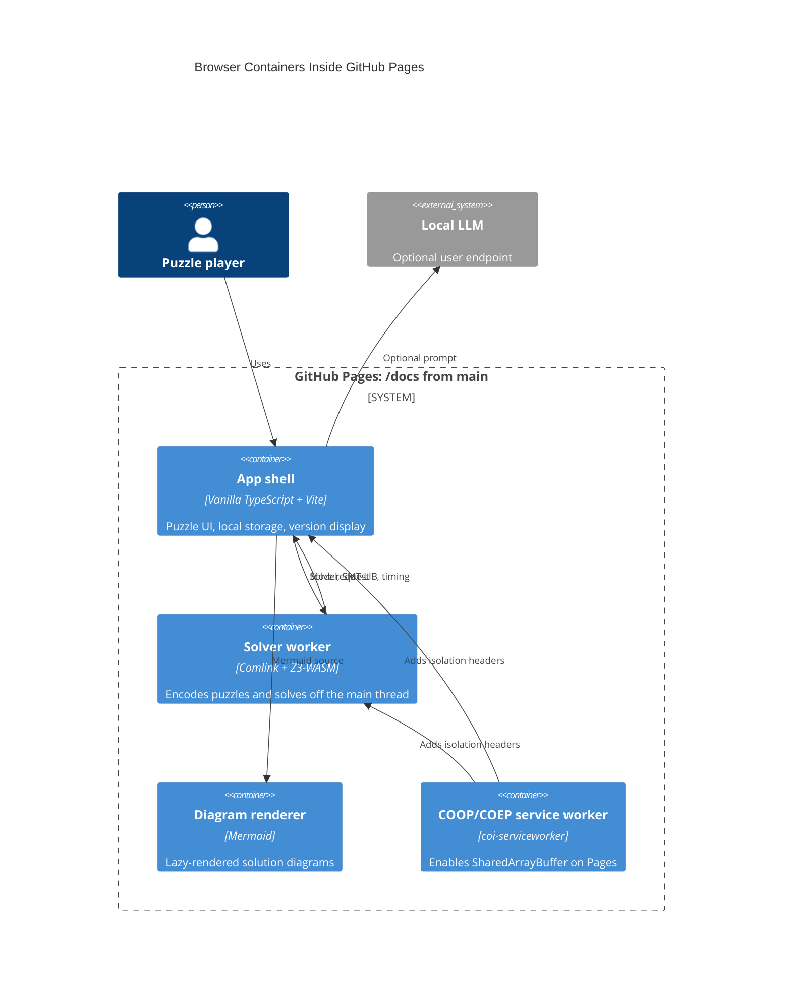

# Architecture

Z3 SMT Game is a Mode A GitHub Pages app. The public runtime boundary is static files served from:

https://baditaflorin.github.io/z3-smt-game/

## Context

## Container

## Module Boundaries

- `src/features/puzzles/`: puzzle catalog and schema validation.
- `src/features/solver/`: worker client, Z3 initialization, puzzle encodings, model extraction.
- `src/features/diagram/`: Mermaid rendering.
- `src/features/explainer/`: deterministic explanation and optional local LLM request.
- `src/shared/`: storage and version helpers.

No runtime backend exists in v1.
